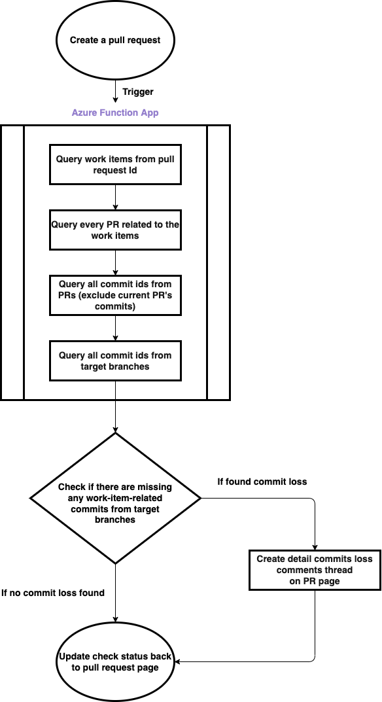

# Work Items Related PR Commits Checker

## Usage

The Azure function that can detect the pull requests linked to work items has any commit dependency loss on the target branch.

## Set-Up

### Environment

1. Following the [official document](https://learn.microsoft.com/en-us/azure/azure-functions/create-first-function-vs-code-csharp?tabs=in-process) to set up an HTTP Triggered function example in VSCode. Here we use `.NET 6.0` as this project’s developing environment.
2. Create & deploy the function in Azure, and retrieve the URL of the function.
3. Go to the Azure DevOps project setting page and create webhooks when pull requests are raised and updated. Use the URL from the previous steps as the target URL so that it will invoke the function every time there are new PRs.
4. Go to `User setting / Personal access tokens` page to create a PAT that has the following authorization:
   1. **Code**: Status
   2. **Pull Request Threads**: Read & Write
   3. **Work Items**: Read
5. Go to the Azure `Function App / Configuration / Applicaiton settings` section to add the PAT into environment variable for the function app.

### Setting trigger branch groups and target branches

Go to [Function App / Configuration / Applicaiton settings](https://ms.portal.azure.com/#@microsoft.onmicrosoft.com/resource/subscriptions/5b03f98c-282c-4ebc-9660-138f9cbf847b/resourceGroups/poc-cdfh-kgib/providers/Microsoft.Web/sites/func-poc-cdfh-kgib/configuration) and set up the variable likes:

```
    "GROUP_1_TRIGGER":"sit-r22, rc-043",
    "GROUP_1_TARGET": "sit-r22, rc-043, sit-r23, rc-044, master, sit",
    "GROUP_2_TRIGGER":"sit-r23, rc-044",
    "GROUP_2_TARGET": "sit-r23, rc-044, master, sit",
    "GROUP_OTHER_BRANCHES": "master, sit"
```

## Design Detail



## API Documents

- [Query work items from pull request](https://learn.microsoft.com/en-us/rest/api/azure/devops/git/pull-request-work-items/list?view=azure-devops-rest-7.0)
- [Query linked pull requests from work item](https://learn.microsoft.com/en-us/rest/api/azure/devops/wit/work-items/get-work-item?view=azure-devops-rest-7.0&tabs=HTTP)
- [Query commits from pull request](https://learn.microsoft.com/en-us/rest/api/azure/devops/git/pull-request-commits/get-pull-request-commits?view=azure-devops-rest-7.0)
- [Query all commits from target branch (use ?searchCriteria.itemVersion.version={targetBranch} as parameter)](https://learn.microsoft.com/en-us/rest/api/azure/devops/git/commits/get-commits?view=azure-devops-rest-7.0&tabs=HTTP)
- [Create check result status on pull request page](https://learn.microsoft.com/en-us/rest/api/azure/devops/git/pull-request-statuses/create?view=azure-devops-rest-7.0&tabs=HTTP)
- [Create new comment thread on pull request page](https://learn.microsoft.com/en-us/rest/api/azure/devops/git/pull-request-threads/create?view=azure-devops-rest-7.0&tabs=HTTP)
